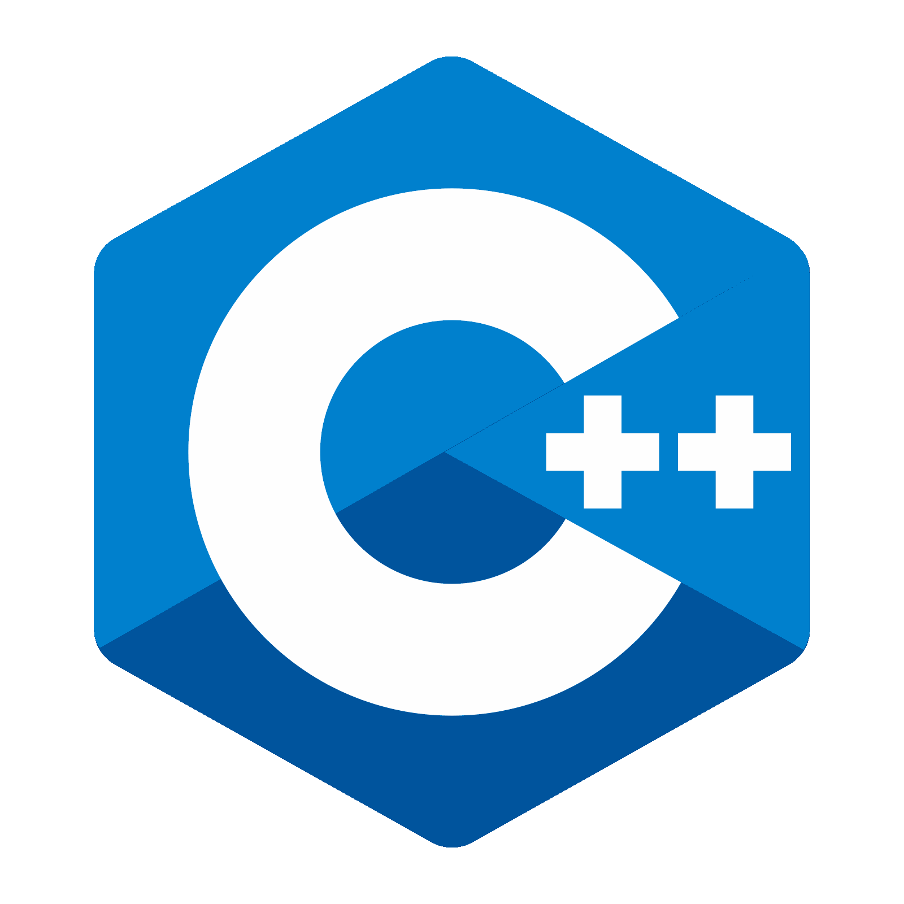
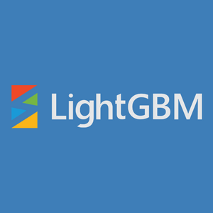
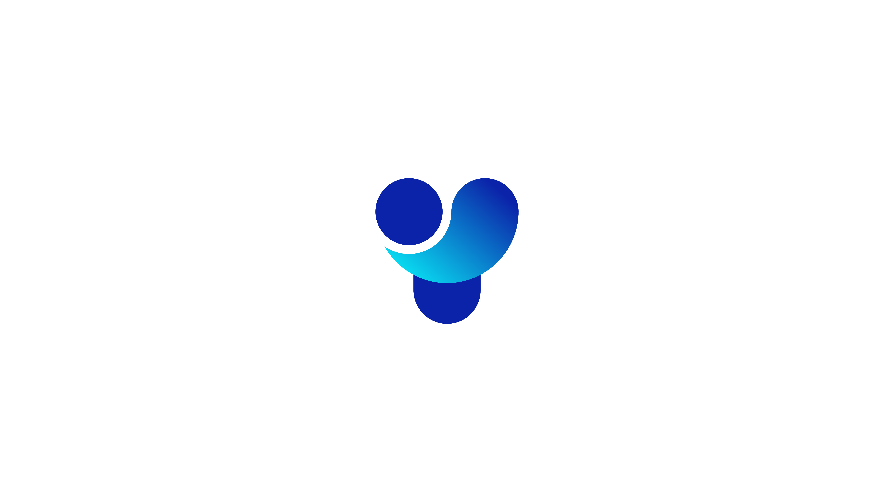

## 👋 Hi, I'm Agilan Sivakumaran

🎓 AI Student @ Durham College  
🚀 AI/ML Engineer | 🤖 MLOps Enthusiast | 💻 Full-Stack Developer  
📍 Based in Canada | Building real-world AI & data solutions  
🌐 [agilan.io](https://agilan.io) | [GitHub](https://github.com/agilancan) | [LinkedIn](https://www.linkedin.com/in/agilan-sivakumaran/)

---

### 🧰 Languages and Tools

#### 💬 Programming Languages  

  

---

### 🔧 Frameworks & Libraries

<!-- Section Heading -->
<h3>🧠 Machine Learning & AI:</h3>

<!-- Icons + Labels Inline with Better Alignment -->

  scikit-learn•

  PyTorch•

  XGBoost•

  LightGBM•

  YOLOv8•

  Hugging Face Transformers•

  OpenCV•

  LangChain•

  MediaPipe

---

**📚 NLP:**  
🧠 `transformers`, 🔤 `spaCy`, 📚 `nltk`, 🧩 `tokenizers`

**🌐 Web & APIs:**  
⚗️ `Flask`, 🐍 `FastAPI`, 🟦 `Gradio`, 🔗 `Requests`

**🧮 Data Processing:**  
📊 `Pandas`, 🔢 `NumPy`, 🧬 `SQLAlchemy`, 📄 `PyYAML`, 🌐 `BeautifulSoup`, 🗃️ `csv`, 🔣 `json`

**📊 Visualization & Dashboards:**  
📈 `Matplotlib`, 🎨 `Seaborn`, 🌍 `Plotly`, 🖥️ `Streamlit`

**🎨 Frontend/UI:**  
⚛️ `React.js`, 🎨 `Tailwind CSS`, 🧊 `Gradio UI`, 🔥 `Firebase UI`

**🤖 Agentic AI / Workflow Orchestration:**  
🧠 `LangChain`, 👥 `CrewAI`, 🔄 `N8N`, 🕸️ `LangGraph`

#### ☁️ Cloud & DevOps  

  

#### 📊 Analytics & Visualization  

  

#### 🧰 Tools & Environments  

  

---

## 🔍 ML & Data Science Projects

### 📊 Bank Marketing Classifier with SVM & Random Forest  
**Repo:** [Bank-Marketing-Classifier-SVM-RF-Showcase](https://github.com/agilancan/Bank-Marketing-Classifier-SVM-RF-Showcase)  
Built and evaluated classification models using SVM and Random Forest on UCI Bank Marketing data. Includes hyperparameter tuning, metrics visualization, and business interpretation.

---

### ❤️ Logistic Regression Heart Risk Model  
**Repo:** [Logistic-Regression-Heart-Risk-Showcase](https://github.com/agilancan/Logistic-Regression-Heart-Risk-Showcase)  
Created a binary classifier to assess heart disease risk. Demonstrates foundational model building, evaluation metrics, and healthcare domain application.

---

### ⛽ Linear Regression Fuel Efficiency Estimator  
**Repo:** [Linear-Regression-Fuel-Efficiency-Showcase](https://github.com/agilancan/Linear-Regression-Fuel-Efficiency-Showcase)  
Developed a regression model to predict MPG based on vehicle attributes. Includes data prep, feature engineering, and visualization.

---

## 🧱 MLOps, API & Deployment Projects

### 🫀 Cardiovascular Risk Predictor (REST API)  
**Repo:** [CVD-Predictor-RESTful-Deployment-Showcase](https://github.com/agilancan/CVD-Predictor-RESTful-Deployment-Showcase)  
Production-ready Flask API that serves a trained CVD prediction model. Includes Docker setup, API testing, and RESTful endpoint design.

---

### 📝 Hugging Face Transformers Summarizer App  
**Repo:** [HuggingFace-Transformers-Summarizer-App-Showcase](https://github.com/agilancan/HuggingFace-Transformers-Summarizer-App-Showcase)  
Built a text summarization tool using Hugging Face Transformers and Gradio. Showcases API integration, model inference pipelines, and UI deployment.

---

## 🧠 LLM, Agentic AI & RAG Projects

### 📚 Multi-Source RAG Pipelines with LangChain  
**Repo:** [Langchain-Multisource-RAG-Pipelines-Showcase](https://github.com/agilancan/Langchain-Multisource-RAG-Pipelines-Showcase)  
Designed RAG pipelines using LangChain to synthesize context from PDFs, websites, and CSVs. Highlights multi-agent design, chaining logic, and prompt engineering.

---

### 🤖 Agentic AI Framework Comparative Study  
**Repo:** [AgenticAI-ComparativeStudy](https://github.com/agilancan/AgenticAI-ComparativeStudy)  
Benchmarked LangGraph, N8N, and CrewAI for building agent-based workflows. Explores use cases, orchestration patterns, and agent role assignment.

---

### 🛡️ SafeRoomAI – Surveillance Intelligence Platform  
**Repo:** [SafeRoomAI-Showcase](https://github.com/agilancan/SafeRoomAI-Showcase)  
Capstone project using **YOLOv8**, **pose estimation**, and **GRU** models for live behavior analysis. Includes motion detection, anomaly classification, AWS-based data infrastructure, and interactive dashboards.

---

## 🌿 Climate & Social Good Projects

### 🌎 GreenEarthConnect – Environmental Awareness App  
**Repo:** [GreenEarthConnect-Showcase](https://github.com/agilancan/GreenEarthConnect-Showcase)  
Created a fullstack dashboard for real-time air quality and traffic-based emissions using public APIs. Combines climate data pipelines with educational UX.

---

## 🎨 UX, Fullstack & Startup Projects

### 🚢 ShipJumper – Peer-to-Peer Rental Platform  
**Repo:** [ShipJumper-Showcase](https://github.com/agilancan/ShipJumper-Showcase)  
A full-featured rental marketplace built with React and Firebase. Includes user auth, listings, search, and booking workflows.

---

### 🎮 HappyFunTime – Multiplayer Social Game  
**Repo:** [HappyFunTime-Showcase](https://github.com/agilancan/HappyFunTime-Showcase)  
A collaborative real-time game that demonstrates frontend/backend sync, WebSocket logic, and interactive UI.

---

### 📱 Doohickey – AI-Enhanced Group Rentals Startup  
**Repo:** [Doohickey-Showcase](https://github.com/agilancan/Doohickey-Showcase)  
Original startup concept. Led product strategy, UX, branding, and frontend development. Features AI-driven listings, team rental coordination, and item tracking.
